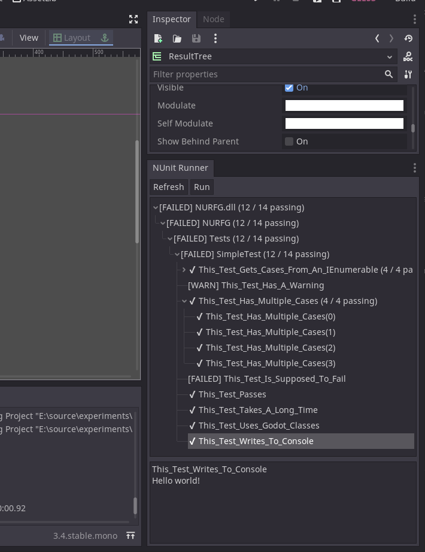
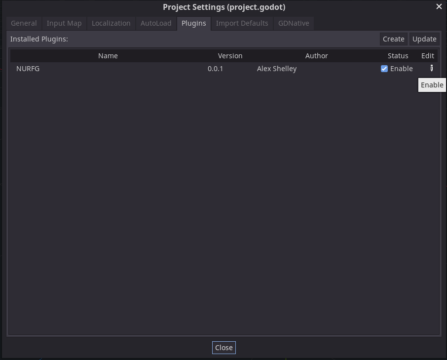

# NURFG: NUnit Runner For Godot

This is an editor plugin for Godot 3.4 mono.  As the name suggests, it locates
and runs NUnit tests.



# Organizing your project
Read this before installing.

In most .NET projects, the standard practice is to have one .csproj for your
production code, and a separate .csproj for your test code.  Unfortunately,
as of version 3.4, Godot does not support solutions with multiple .csproj files.
As a consequence, you will need to put your tests in the same project as your
production code.

This is sub-optimal, but there are ways of coping  with it.  My suggestion is to:
* Keep all of your tests in a separate folder
* Exclude that folder from the release build
* Use a separate namespace for your tests, so you don't accidentally call test
    code in your production code.

The [Installation](#installation) section will walk you through setting up your
.csproj file for this.

# Installation

1. [Install NUnit(without shipping it with your game)](#install-nunit-without-shipping-it-with-your-game)
1. [Exclude your tests from the release build](#exclude-your-tests-from-the-release-build)
1. [Install the NURFG plugin in your project](#installing-nurfg)

## Install NUnit (without shipping it with your game)
First, you need to install the NUnit nuget package in your game's .csproj file.
Ideally, you'll want to install it in such a way that it does not ship with your
final game.

You can do that by manually adding these lines to your .csproj, in between the
`<Project>` and `</Project>` tags:

```xml
  <!-- NuGet packages used only by tests belong here -->
  <ItemGroup Condition="'$(Configuration)'=='DEBUG'">
    <PackageReference Include="NUnit" Version="3.13.2" />
  </ItemGroup>
```

Replace `3.13.2` with the version of NUnit that you want to use.  The extra
junk in the `<ItemGroup>` tag prevents all packages listed in this section from
being included in your release build, so they won't ship with the final game.

## Exclude your tests from the release build
Next, you need to exclude your tests from the release build, so they don't ship
with your game.  Paste these lines into your .csproj file, again between the
`<Project>` and `</Project>` tags:

```xml
  <ItemGroup Condition="'$(Configuration)'!='DEBUG'">
    <Compile Remove="Tests\**" />
    <EmbeddedResource Remove="Tests\**" />
  </ItemGroup>
```

Replace `Tests` with the path to the folder containing your tests, relative to
the .csproj file.

Your final .csproj file will look something like this:

```xml
<Project Sdk="Godot.NET.Sdk/3.3.0">

  <PropertyGroup>
    <TargetFramework>net472</TargetFramework>
  </PropertyGroup>

  <!-- NuGet packages used only by tests belong here -->
  <ItemGroup Condition="'$(Configuration)'=='DEBUG'">
    <PackageReference Include="NUnit" Version="3.13.2" />
  </ItemGroup>

  <!-- Excludes tests from the release build -->
  <ItemGroup Condition="'$(Configuration)'!='DEBUG'">
    <Compile Remove="Tests\**" />
    <EmbeddedResource Remove="Tests\**" />
  </ItemGroup>

</Project>
```

## Installing NURFG
Clone this repo and copy/paste the "addons" folder into your project.  Your
folder structure should look like this:

```
* addons/
    * NURFG/
* Tests/
    * your tests go here
* YOUR_GAME_NAME.csproj
* YOUR_GAME_NAME.sln
* project.godot
```

Finally, enable the plugin from the project settings window:
